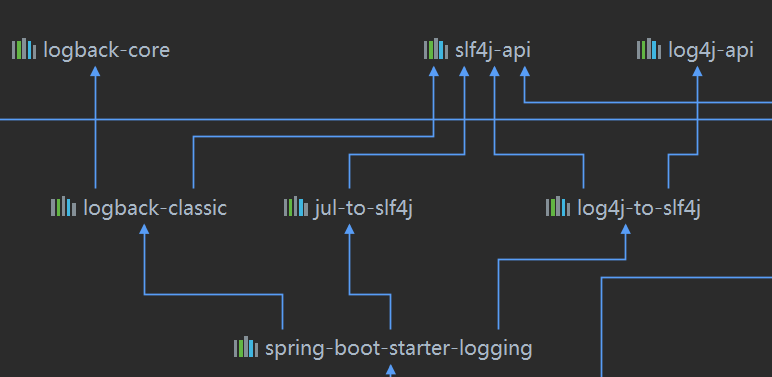

## 一、简介 ##

1. 快速创建独立运行的Spring项目以及主流框架集成
2. 嵌入式Servlet容器，无需打成War包
3. starters自动依赖与版本控制
4. 大量的自动配置，简化开发
5. 无需配置XML，无代码生成

## 二、启动和配置

### @SpringBootApplication启动注解 ###
1. @SpringBootConfiguration
等同于@Configuration
2. @EnableAutoConfiguration开启自动配置

	- @AutoConfigurationPackage
		- @Import(AutoConfigurationPackages.Registrar.class)
		将主配置类(@SpringBootApplication)的所在包及下面所有子包的所有组件扫描到Spring容器	
	- @Import(AutoConfigurationPackages.Registrar.class)
	会给容器中导入很多的自动配置类(XxxAutoConfiguration),给容器中导入这个场景需要的所有组件

`Lis`t<String> configurations = SpringFactoriesLoader.loadFactoryNames(getSpringFactoriesLoaderFactoryClass(),`
				getBeanClassLoader());`

Spring Boot在启动的时候从类路径下的META-INF/spring.factories获取EnableAutoConfiguration指定的值，将这些值作为自动配置类导入到容器中，自动配置类就生效。

J2EE的整体整合解决方案和自动配置都在spring-boot-autoconfigure-2.3.0.RELEASE.jar内

### 配置文件

Spring Boot使用一个全局配置文件，修改默认的自动配置：

- application. properties

- application.yml

  yml是yaml的缩写(YAML Ain't Markup Language)，以数据为中心，比json、xml更适合作为配置文件

### 配置文件属性注入

#### @ConfigurationProperties & @Value

1. 在yml文件中设置好对应的值

2. 在对应的要注入的类中添加注解：

   ``` java
   @Component
   @ConfigurationProperties(prefix = "user") // prefix就是yml中设置的首部
   ```

3. 也可以使用@Value注入值

比较：

|                | @ConfigurationProperties | @Value       |
| -------------- | ------------------------ | ------------ |
| 功能           | 批量注入配置文件中的属性 | 一个一个指定 |
| 松散绑定       | 支持                     | 不支持       |
| SpEl           | 不支持                   | 支持         |
| JSR303数据校验 | 支持                     | 不支持       |

#### @PropertySource & @ImportResource

@PropertySource：加载指定的配置文件

@ImportResource：导入Spring的xml配置文件，让配置文件里面的内容生效，加在主类上

### Profile

在配置文件编写时，文件名可以使application-{profile}.yml/properties	

在yml文件中，使用'---'，可以支持多文档快模式

#### 激活指定profile

1. 在主配置文件中可以指定spring.profiles.active=dev
2.  虚拟机参数 -Dspring.profiles.active=dev
3. 命令行 --spring.profiles.active=dev

### 配置文件加载位置

优先级由高到低， 高优先级的配置会覆盖低优先级的配置

- file:./config/
- file:./
- classpath:/config/
- classpath:/

项目打包好以后，可以使用命令行参数的形式，通过**--spring.config.location**指定配置文件的新位置 ，会与原来的配置形成互补

### 自动配置原理

1. SpringBoot启动的时候加载主配置类，开启了自动配置功能@EnableAutoConfiguration

2. 在@EnableAutoConfiguration中会使用@Import(AutoConfigurationPackages.Registrar.class)
   会给容器中导入很多的自动配置类(XxxAutoConfiguration)，给容器中导入这个场景需要的所有组件

   ```java
   List<String> configurations = SpringFactoriesLoader.loadFactoryNames(getSpringFactoriesLoaderFactoryClass(),
                                          getBeanClassLoader());
   ```

   Spring Boot在启动的时候从类路径下的META-INF/spring.factories获取EnableAutoConfiguration指定的值，将这些值作为自动配置类导入到容器中，自动配置类就生效。

3. 以HttpEncodingAutoConfiguration为例

   ``` java
   @Configuration(proxyBeanMethods = false) // 标识配置类
   @EnableConfigurationProperties(ServerProperties.class) // 启用ConfigurationProperties功能
   @ConditionalOnWebApplication(type = ConditionalOnWebApplication.Type.SERVLET) // 判断当前是不是web应用，如果是则生效
   @ConditionalOnClass(CharacterEncodingFilter.class) // 判断当前项目有没有这个类
   @ConditionalOnProperty(prefix = "server.servlet.encoding", value = "enabled", matchIfMissing = true) //  判断配置文件中是否存在某个配置类
   public class HttpEncodingAutoConfiguration {
       ...
   }
   ```

   根据当前不同的条件判断，决定这个配置类是否生效

4. 在配置文件中配置的信息，都是来源于具体类中定义的属性

总结：

1. SpringBoot启动时会加载大量的自动配置类
2. 我们看自己需要的功能有没有SpringBoot默认写好的自动配置类
3. 然后看这个自动配置类中到底配置了哪些组件（如果有了，就不需要自己配置了）
4. 给容器中自动配置类添加组件的时候，会从properties类中获取某些属性

#### @Conditional派生注解

作用：必须是@Conditional指定的条件成立，才给容器中添加组件，配置配里面的所有内容才生效

| @Conditional扩展注解            | 作用（判断是否满足当前指定条件）                 |
| ------------------------------- | ------------------------------------------------ |
| @ConditionalOnJava              | 系统的java版本是否符合要求                       |
| @ConditionalOnBean              | 容器中存在指定Bean；                             |
| @ConditionalOnMissingBean       | 容器中不存在指定Bean；                           |
| @ConditionalOnExpression        | 满足SpEL表达式指定                               |
| @ConditionalOnClass             | 系统中有指定的类                                 |
| @ConditionalOnMissingClass      | 系统中没有指定的类                               |
| @ConditionalOnSingleCandidate   | 容器中只有一个指定的Bean，或者这个Bean是首选Bean |
| @ConditionalOnProperty          | 系统中指定的属性是否有指定的值                   |
| @ConditionalOnResource          | 类路径下是否存在指定资源文件                     |
| @ConditionalOnWebApplication    | 当前是web环境                                    |
| @ConditionalOnNotWebApplication | 当前不是web环境                                  |
| @ConditionalOnJndi              | JNDI存在指定项                                   |

#### 如何知道哪些自动配置类生效？

在配置文件中加入debug: true，在控制台打印自动配置报告可以看到Positive matches、Negative matches


## 三、日志

### 市面上的日志框架

JUL、JCL、Jboss-logging、logback、log4j、log4j2、slf4j....

| 日志门面 （日志的抽象层）                   | 日志实现                    |
| ------------------------------------------- | --------------------------- |
| ~~JCL（Jakarta Commons Logging)~~           | JUL（java.util.logging）    |
| **SLF4j（Simple Logging Facade for Java）** | Log4j 、**Logback**、Log4j2 |
| ~~jboss-logging~~                           |                             |

左边选一个门面（抽象层）、右边选一个实现

**SpringBoot选用SLF4j和Logback**


### SLF4j使用

以后开发的时候，日志记录方法的调用，不应该来直接调用日志的实现类，而是调用日志抽象层里面的方法；

给系统里面导入slf4j的jar和 logback的实现jar

```java
import org.slf4j.Logger;
import org.slf4j.LoggerFactory;

public class HelloWorld {
  public static void main(String[] args) {
    Logger logger = LoggerFactory.getLogger(HelloWorld.class);
    logger.info("Hello World");
  }
}
```


每一个日志的实现框架都有自己的配置文件。使用slf4j以后，**配置文件还是使用日志实现框架自己本身的配置文件**；

### 遗留问题

项目中依赖的框架可能使用不同的日志：

Spring（commons-logging）、Hibernate（jboss-logging）、MyBatis、xxxx

当项目是使用多种日志API时，可以统一适配到SLF4J，中间使用SLF4J或者第三方提供的日志适配器适配到SLF4J，SLF4J在底层用开发者想用的一个日志框架来进行日志系统的实现，从而达到了多种日志的统一实现。

### 如何让系统中所有的日志都统一到slf4j？

1. 将系统中其他日志框架先排除出去
2. 用中间包(*-over-slf4j.jar)来替换原有的日志框架（适配器的类名和包名与替换的被日志框架一致）
3. 导入slf4j的实现


### SpringBoot日志关系



1. SpringBoot底层使用slf4j+logback的方式进行日志记录
2. SpringBoot也把其他的日志都替换成了slf4j
3. **SpringBoot能自动适配所有的日志，引入其他框架的时候，只需要把这个框架依赖的日志框架排除掉即可**

### 日志使用

#### 日志级别

由低到高   trace<debug<info<warn<error

#### 默认配置

- 若无配置，则只打印到控制台中，不会生成文件

- 使用logging.file.path指定生成日志目录

#### 指定配置

给类路径下放上每个日志框架自己的配置文件，会覆盖默认配置

| Logging System          | Customization                                                |
| ----------------------- | ------------------------------------------------------------ |
| Logback                 | `logback-spring.xml`, `logback-spring.groovy`, `logback.xml` or `logback.groovy` |
| Log4j2                  | `log4j2-spring.xml` or `log4j2.xml`                          |
| JDK (Java Util Logging) | `logging.properties`                                         |

logback.xml：直接会被日志框架识别

**logback-spring.xml**：日志框架不直接加载日志的配置项，由SpringBoot解析日志配置，可以使用SpringBoot的高级Profile功能

#### 切换日志框架

可以按照slf4j的日志适配图，进行相关的切换，把相应关系的依赖排除，再引入自己想要使用的依赖

## 四、Web开发

### 1. Web自动配置规则

1. WebMvcAutoConfiguration
2. WebMvcProperties
3. ViewResolver自动配置
4. 静态资源自动映射
5. Formatter与Converter自动配置
6. HttpMessageConverter自动配置
7. 静态首页
8. favicon
9. 错误处理

#### SpringBoot对静态资源的映射规则

```java
@Override
public void addResourceHandlers(ResourceHandlerRegistry registry) {
   if (!this.resourceProperties.isAddMappings()) {
      logger.debug("Default resource handling disabled");
      return;
   }
   Duration cachePeriod = this.resourceProperties.getCache().getPeriod();
   CacheControl cacheControl = this.resourceProperties.getCache().getCachecontrol().toHttpCacheControl();
   if (!registry.hasMappingForPattern("/webjars/**")) {
      customizeResourceHandlerRegistration(registry.addResourceHandler("/webjars/**")
            .addResourceLocations("classpath:/META-INF/resources/webjars/")
            .setCachePeriod(getSeconds(cachePeriod)).setCacheControl(cacheControl));
   }
   String staticPathPattern = this.mvcProperties.getStaticPathPattern();
   if (!registry.hasMappingForPattern(staticPathPattern)) {
      customizeResourceHandlerRegistration(registry.addResourceHandler(staticPathPattern)
            .addResourceLocations(getResourceLocations(this.resourceProperties.getStaticLocations()))
            .setCachePeriod(getSeconds(cachePeriod)).setCacheControl(cacheControl));
   }
}
```

- 所有 `/webjars/**` ，都去 `classpath:/META-INF/resources/webjars/` 找资源

- 添加的映射访问路径`staticPathPattern`值是`/**`，对应的资源文件夹就是上面配置类`ResourceProperties`中的`CLASSPATH_RESOURCE_LOCATIONS`数组中的文件夹：

```java
private String staticPathPattern = "/**";

private static final String[] CLASSPATH_RESOURCE_LOCATIONS = { "classpath:/META-INF/resources/", "classpath:/resources/", "classpath:/static/", "classpath:/public/" };
```

| 数组中的值                     | 在项目中的位置                         |
| ------------------------------ | -------------------------------------- |
| classpath:/META-INF/resources/ | src/main/resources/META-INF/resources/ |
| classpath:/resources/          | src/main/resources/resources/          |
| classpath:/static/             | src/main/resources/static/             |
| classpath:/public/             | src/main/resources/public/             |

#### 欢迎页映射

``` java
@Bean
public WelcomePageHandlerMapping welcomePageHandlerMapping(ApplicationContext applicationContext,
      FormattingConversionService mvcConversionService, ResourceUrlProvider mvcResourceUrlProvider) {
   WelcomePageHandlerMapping welcomePageHandlerMapping = new WelcomePageHandlerMapping(
         new TemplateAvailabilityProviders(applicationContext), applicationContext, getWelcomePage(),
         this.mvcProperties.getStaticPathPattern());
   welcomePageHandlerMapping.setInterceptors(getInterceptors(mvcConversionService, mvcResourceUrlProvider));
   welcomePageHandlerMapping.setCorsConfigurations(getCorsConfigurations());
   return welcomePageHandlerMapping;
}
private Optional<Resource> getWelcomePage() {
			String[] locations = getResourceLocations(this.resourceProperties.getStaticLocations());
			return Arrays.stream(locations).map(this::getIndexHtml).filter(this::isReadable).findFirst();
		}

private Resource getIndexHtml(String location) {
    return this.resourceLoader.getResource(location + "index.html");
}
```

`location`就是静态资源路径，所以欢迎页的页面就是上面静态资源下的`index.html`，被`/**`映射，因此直接访问项目就是访问欢迎页

#### 网站图标映射（favicon.ico）

所有的 favicon.ico 都是在静态资源文件下找；

### 2. Thymeleaf自动配置

常见的模板引擎有`JSP`、`Velocity`、`Freemarker`、`Thymeleaf`，SpringBoot推荐使用Thymeleaf

```java
package org.springframework.boot.autoconfigure.thymeleaf;

......

@ConfigurationProperties(
    prefix = "spring.thymeleaf"
)
public class ThymeleafProperties {
    private static final Charset DEFAULT_ENCODING;
    public static final String DEFAULT_PREFIX = "classpath:/templates/";
    public static final String DEFAULT_SUFFIX = ".html";
    private boolean checkTemplate = true;
    private boolean checkTemplateLocation = true;
    private String prefix = "classpath:/templates/";
    private String suffix = ".html";
    private String mode = "HTML";
```

默认只要我们把HTML页面放在`classpath:/templates/`，thymeleaf就能自动渲染

#### Thymeleaf语法

创建模板文件`*.html`，并导入thymeleaf的名称空间

### 3. SpringMVC自动配置

SpringBoot自动配置好了SpringMVC

- Inclusion of `ContentNegotiatingViewResolver` and `BeanNameViewResolver` beans.

  - 自动配置了ViewResolver
  - ContentNegotiatingViewResolver可以组合所有的视图解析器
  - **我们可以自己给容器中添加一个视图解析器，它便会自动的被组合进来**

- Support for serving static resources, including support for WebJars

  - 静态资源文件路径

- Automatic registration of `Converter`, `GenericConverter`, and `Formatter` beans.

  - Converter转换器，类型转换，如String->Integer等

  - Formatter格式化器，格式转换，如2020.5.20 -> Date

    ```java
    public static void addBeans(FormatterRegistry registry, ListableBeanFactory beanFactory) {
       Set<Object> beans = new LinkedHashSet<>();
       beans.addAll(beanFactory.getBeansOfType(GenericConverter.class).values());
       beans.addAll(beanFactory.getBeansOfType(Converter.class).values());
       beans.addAll(beanFactory.getBeansOfType(Printer.class).values());
       beans.addAll(beanFactory.getBeansOfType(Parser.class).values());
       for (Object bean : beans) {
          if (bean instanceof GenericConverter) {
             registry.addConverter((GenericConverter) bean);
          }
          else if (bean instanceof Converter) {
             registry.addConverter((Converter<?, ?>) bean);
          }
          else if (bean instanceof Formatter) {
             registry.addFormatter((Formatter<?>) bean);
          }
          else if (bean instanceof Printer) {
             registry.addPrinter((Printer<?>) bean);
          }
          else if (bean instanceof Parser) {
             registry.addParser((Parser<?>) bean);
          }
       }
    }
    ```

  - **自己添加的格式化器、转化器，只需要放在容器中即可**

- Support for `HttpMessageConverters`

  - SpringMVC用来转换Http请求和相应的，如User-Json
  - **自己添加的转化器，只需要放在容器中即可**

- Automatic registration of `MessageCodesResolver` 

  - 定义错误代码生成规则

- Static `index.html` support.

  - 静态首页访问

- Custom `Favicon` support 

  - favicon.ico

- Automatic use of a `ConfigurableWebBindingInitializer` bean 

  - `ConfigurableWebBindingInitializer`用来初始化WebDataBinder
  - **使用自己的`ConfigurableWebBindingInitializer`，放入容器中即可**

#### 扩展SpringMVC

**编写一个配置类（@Configuration），实现WebMvcConfigurer接口；不能标注@EnableWebMvc**

这种方式既保留了SpringBoot的自动配置，又扩展了我们的配置

原理：

1. 首先会到WebMvcAutoConfiguration

2. 在做其他自动配置时会导入@Import(**EnableWebMvcConfiguration.class**)

   ```java
   public class DelegatingWebMvcConfiguration extends WebMvcConfigurationSupport {
   
      private final WebMvcConfigurerComposite configurers = new WebMvcConfigurerComposite();
   	
      //自动注入，从容器中获取所有的WebMvcConfigurer
      @Autowired(required = false)
      public void setConfigurers(List<WebMvcConfigurer> configurers) {
         if (!CollectionUtils.isEmpty(configurers)) {
            this.configurers.addWebMvcConfigurers(configurers);
         }
      }
   ```

3. 容器中所有的WebMvcConfigurer都会一起起作用，我们的配置类也会被调用；

#### 全面接管SpringMVC

编写一个配置类（@Configuration），实现WebMvcConfigurer接口，**并且标注@EnableWebMvc，所有的自动配置都失效**

原理：

@EnableWebMvc源码：

```java
@Import(DelegatingWebMvcConfiguration.class) //Delegating 授权
public @interface EnableWebMvc {
}
```

而DelegatingWebMvcConfiguration是WebMvcConfigurationSupport的子类

```java
public class DelegatingWebMvcConfiguration extends WebMvcConfigurationSupport {
    ...
}
```

而在WebMvcAutoConfiguration的注解信息上，会判断容器中没有WebMvcConfigurationSupport类，自动配置才会生效

```java
@ConditionalOnMissingBean(WebMvcConfigurationSupport.class)
public class WebMvcAutoConfiguration {
    ...
}
```

@EnableWebMvc将WebMvcConfigurationSupport组件导入进来，只具有最基本的功能

#### 如何修改SpringBoot的默认配置？

SpringBoot在自动配置很多组件的时候，先看容器中有没有用户自己配置的（通过@ConditionalOnMissingBean）

- 如果没有，才自动默认配置；
- 如果某些组件可以有多个，则会将用户配置的和默认的组合起来

在SpringBoot中会有非常多的XxxConfigurer帮助我们进行扩展配置，XxxCustomizer帮助我们进行定制配置

### 4. i18n国际化

1. 编写国际化配置文件，抽取页面需要显示的国际化消息。创建i18n文件夹存放配置文件，文件名格式为`基础名(login)`+`语言代码(zh)`+`国家代码(CN)`
2. 在配置文件中添加国际化文件的位置和基础名
   - 如果配置文件中没有配置基础名，就在类路径下找基础名为`message`的配置文件
3. 将页面文字改为获取国际化配置，格式`#{key}` 
4. 根据浏览器语言信息切换国际化

原理：

在MessageSourceAutoConfiguration类中，把**ResourceBundleMessageSource**添加到了容器中

```java
public class MessageSourceAutoConfiguration {
@Bean
public MessageSource messageSource(MessageSourceProperties properties) {
   ResourceBundleMessageSource messageSource = new ResourceBundleMessageSource();
   if (StringUtils.hasText(properties.getBasename())) {
      // 设置国际化资源文件的基础名字（去掉国家语言代码）
       messageSource.setBasenames(StringUtils     .commaDelimitedListToStringArray(StringUtils.trimAllWhitespace(properties.getBasename())));
   }
   if (properties.getEncoding() != null) {
      messageSource.setDefaultEncoding(properties.getEncoding().name());
   }
   messageSource.setFallbackToSystemLocale(properties.isFallbackToSystemLocale());
   Duration cacheDuration = properties.getCacheDuration();
   if (cacheDuration != null) {
      messageSource.setCacheMillis(cacheDuration.toMillis());
   }
   messageSource.setAlwaysUseMessageFormat(properties.isAlwaysUseMessageFormat());
   messageSource.setUseCodeAsDefaultMessage(properties.isUseCodeAsDefaultMessage());
   return messageSource;
}
```

5. 实现点击连接切换语言

原理：

**Locale，是区域信息对象**

LocaleResolver，是用来获取区域信息对象的组件

在在springmvc配置类`WebMvcAutoConfiguration`中默认注册了LocaleResolver

```java
@Bean
@ConditionalOnMissingBean
@ConditionalOnProperty(prefix = "spring.mvc", name = "locale")
public LocaleResolver localeResolver() {
   if (this.mvcProperties.getLocaleResolver() == WebMvcProperties.LocaleResolver.FIXED) {
      return new FixedLocaleResolver(this.mvcProperties.getLocale());
   }
   AcceptHeaderLocaleResolver localeResolver = new AcceptHeaderLocaleResolver();
   localeResolver.setDefaultLocale(this.mvcProperties.getLocale());
   return localeResolver;
}
```

由于@ConditionalOnMissingBean，所以自己实现区域信息解析器，并在配置类中将其注册到容器中，SpringBoot将会自动注册我们配置的LocaleResolver

### 5. 错误处理机制

在ErrorMvcAutoConfiguration配置中，处理错误的自动配置，Springboot做了自适应效果，浏览器访问响应错误页面。客户端访问响应错误信息的json数据

向容器中添加如下组件：

1. DefaultErrorAttributes

   添加一些错误的信息

   ```java
   @Override
   @Deprecated
   public Map<String, Object> getErrorAttributes(WebRequest webRequest, boolean includeStackTrace) {
      Map<String, Object> errorAttributes = new LinkedHashMap<>();
      errorAttributes.put("timestamp", new Date());
      addStatus(errorAttributes, webRequest);
      addErrorDetails(errorAttributes, webRequest, includeStackTrace);
      addPath(errorAttributes, webRequest);
      return errorAttributes;
   }
   ```

2. BasicErrorController

   处理默认/error请求

   ```java
   @Controller
   @RequestMapping("${server.error.path:${error.path:/error}}")
   public class BasicErrorController extends AbstractErrorController {
       // 产生HTML数据，浏览器发送的请求使用这个方法进行处理
       @RequestMapping(produces = MediaType.TEXT_HTML_VALUE)
   	public ModelAndView errorHtml(HttpServletRequest request, HttpServletResponse response) {
   		HttpStatus status = getStatus(request);
   		Map<String, Object> model = Collections
   				.unmodifiableMap(getErrorAttributes(request, getErrorAttributeOptions(request, MediaType.TEXT_HTML)));
   		response.setStatus(status.value());
           // 去哪个页面作为错误页面，包含页面地址和页面内容
   		ModelAndView modelAndView = resolveErrorView(request, response, status, model);
   		return (modelAndView != null) ? modelAndView : new ModelAndView("error", model);
   	}
   	// 产生JSON数据，其他客户端来到这个方法处理
   	@RequestMapping
   	public ResponseEntity<Map<String, Object>> error(HttpServletRequest request) {
   		HttpStatus status = getStatus(request);
   		if (status == HttpStatus.NO_CONTENT) {
   			return new ResponseEntity<>(status);
   		}
   		Map<String, Object> body = getErrorAttributes(request, getErrorAttributeOptions(request, MediaType.ALL));
   		return new ResponseEntity<>(body, status);
   	}
   }
   ```

3. ErrorPageCustomizer

   系统出现错误以后来到error请求进行处理（web.xml注册的错误页面）

   ```java
   @Value("${error.path:/error}")
   private String path = "/error";
   ```

4. DefaultErrorViewResolver

   ```java
   private ModelAndView resolve(String viewName, Map<String, Object> model) {
      // 默认SpringBoot去找一个页面
       String errorViewName = "error/" + viewName;
       // 模版引擎可以解析这个页面地址就用模版引擎解析
      TemplateAvailabilityProvider provider = this.templateAvailabilityProviders.getProvider(errorViewName,
            this.applicationContext);
       // 模版引擎可用的情况下，就使用模版引擎指定的errorViewName视图
      if (provider != null) {
         return new ModelAndView(errorViewName, model);
      }
       // 模版引擎不可用，就在静态资源文件下找errorViewName
      return resolveResource(errorViewName, model);
   }
   ```

步骤：

​		一旦系统出现错误4xx，5xx，ErrorPageCustomizer(定制错误的相应规则)就会生效，则来到/error请求，被BasicErrorController请求

#### 如何定制错误响应

1. 有模版引擎的情况下：error/状态码.html，发生此状态码的错误就会来到相应的页面

   可以使用4xx和5xx作为错误页面的文件名来匹配这两种类型的错误，精确优先

   页面能够获取的信息：

   - timestamp：时间戳
   - status：状态码
   - error：错误提示
   - exception：异常对象
   - message：异常消息
   - errors：JSR303数据校验的错误都在这里

2. 没有模版引擎，在静态资源文件夹下找
3. 以上都没有错误页面，就默认使用SpringBoot错误提示页面（在内部类StaticView中）

#### 如何定制JSON数据

1. 第一种方法：定义全局异常处理器类注入到容器中，捕获到异常返回json格式的数据

   ```java
   @ControllerAdvice
   public class MyExceptionHandler {
   
       @ResponseBody
       @ExceptionHandler(Exception.class)
       public Map<String, Object> handleException(Exception e) {
           Map<String, Object> map = new HashMap(2);
           map.put("code", "100011");
           map.put("msg", e.getMessage());
           return map;
       }
   }
   ```

   这样的话，不管是浏览器访问还是客户端访问都是响应json数据，就没有了自适应效果

2. 第二种方法，捕获到异常后转发到/error

   ```java
   @ControllerAdvice
   public class MyExceptionHandler {
   
       @ExceptionHandler(Exception.class)
       public String handleException(Exception e) {
           Map<String, Object> map = new HashMap(2);
           map.put("code", "100011");
           map.put("msg", e.getMessage());
           return "forward:/error";
       }
   }
   ```

### 6. 配置嵌入式Servlet容器

SpringBoot默认使用嵌入的Servlet容器（Tomcat）

#### 修改Servlet容器的相关配置

1. 配置文件修改server有关的配置（ServerProperties）

   ```yml
   server:
     port: 8080
   #通用的Servlet容器设置
   server:
   	xxx
   #Tomcat的设置
   server:
   	tomcat:
   		xxx
   ```

2. 编写WebServerFactoryCustomizer，嵌入式的Servlet容器的定制器，来修改Servlet容器的配置

   ```java
   @Bean
   public WebServerFactoryCustomizer webServerFactoryCustomizer(){
       return (WebServerFactoryCustomizer<ConfigurableWebServerFactory>) factory -> factory.setPort(8081);
   }
   ```

#### 注册Servlet三大组件

由于SpringBoot默认是以jar包的方式启动嵌入式的Servlet容器来启动SpringBoot的web应用，没有web.xml文件。

##### Servlet

向容器中添加ServletRegistrationBean

##### Filter

向容器中添加FilterRegistrationBean

##### Listener

向容器中添加ServletListenerRegistrationBean

SpringBoot帮我们配置SpringMVC的时候，自动注册SpringMVC的DispatcherServlet，使用了DispatcherServletAutoConfiguration

#### 使用其他Servlet容器

- Tomcat(默认)

- Jetty
- Netty

- Udertow(不支持JSP)

切换时，将Tomcat的start排除，再引入其他的依赖即可

#### 嵌入式Servlet容器自动配置原理

在web.servlet包下**ServletWebServerFactoryAutoConfiguration**中

```java
@Bean
@ConditionalOnClass(name = "org.apache.catalina.startup.Tomcat")
public TomcatServletWebServerFactoryCustomizer tomcatServletWebServerFactoryCustomizer(
      ServerProperties serverProperties) {
   return new TomcatServletWebServerFactoryCustomizer(serverProperties);
}
```

在web.embedded包下EmbeddedWebServerFactoryCustomizerAutoConfiguration中

会根据导入的依赖配置不同的Servlet容器

```java
@ConditionalOnClass({ Tomcat.class, UpgradeProtocol.class })
public static class TomcatWebServerFactoryCustomizerConfiguration {...}
    
@ConditionalOnClass({ Server.class, Loader.class, WebAppContext.class })
public static class JettyWebServerFactoryCustomizerConfiguration {...}
        
@ConditionalOnClass({ Undertow.class, SslClientAuthMode.class })
public static class UndertowWebServerFactoryCustomizerConfiguration {...}
        
@ConditionalOnClass(HttpServer.class)
public static class NettyWebServerFactoryCustomizerConfiguration {...}
```

在boot.web.embedded.tomcat包下TomcatServletWebServerFactory中

```java
@Override
public WebServer getWebServer(ServletContextInitializer... initializers) {
   if (this.disableMBeanRegistry) {
      Registry.disableRegistry();
   }
    // 创建Tomcat
   Tomcat tomcat = new Tomcat();
    // 配置Tomcat的基本环境
   File baseDir = (this.baseDirectory != null) ? this.baseDirectory : createTempDir("tomcat");
   tomcat.setBaseDir(baseDir.getAbsolutePath());
   Connector connector = new Connector(this.protocol);
   connector.setThrowOnFailure(true);
   tomcat.getService().addConnector(connector);
   customizeConnector(connector);
   tomcat.setConnector(connector);
   tomcat.getHost().setAutoDeploy(false);
   configureEngine(tomcat.getEngine());
   for (Connector additionalConnector : this.additionalTomcatConnectors) {
      tomcat.getService().addConnector(additionalConnector);
   }
   prepareContext(tomcat.getHost(), initializers);
   return getTomcatWebServer(tomcat);
}
```

总结：

1. SpringBoot根据导入的依赖情况，给容器中添加相应的`XXX`ServletWebServerFactory

2. 容器中某个组件要创建对象就会惊动后置处理器 `webServerFactoryCustomizerBeanPostProcessor`

   只要是嵌入式的是Servlet容器工厂，后置处理器就会工作；

3. 后置处理器，从容器中获取所有的`WebServerFactoryCustomizer`，调用定制器的定制方法给工厂添加配置

### 7.使用外置的Servlet容器

1. 将项目的打包方式改为war
2. tomcat的依赖范围改为provided
3. 编写一个类继承`SpringBootServletInitializer`，并重写configure方法

#### Servlet3.0标准

1. 服务器启动(web应用启动)会创建当前web应用里面每一个jar包里面的ServletContainerInitializer实例
2. Servlet3.0标准ServletContainerInitializer扫描所有jar包中META-INF/services下javax.servlet.ServletContainerInitializer文件指定的类并加载
3. 还可以使用@HandlesTypes，在应用启动的时候加载我们感兴趣的类；

#### 流程

1. 启动Tomcat	

2. 在spring-web-xxx.jar包中的META-INF/services下有javax.servlet.ServletContainerInitializer这个文件

   文件中的类是：

   ```
   org.springframework.web.SpringServletContainerInitializer
   ```

3. SpringServletContainerInitializer将@HandlesTypes(WebApplicationInitializer.class)标注的所有这个类型的类都传入到onStartup方法的`Set<Class<?>>`；为这些WebApplicationInitializer类型的类创建实例；


## 五、SpringBoot数据访问

对于数据访问层，无论是SQL还是NOSQL，SpringBoot采用整个SpringData方式进行统一处理

SpringData是Spring技术栈里一个项目

### 1. jdbc

依赖项为spring-boot-starter-data-jdbc，配置如下

```yaml
spring:
  datasource:
    username: root
    password: 123456
    url: jdbc:mysql://192.168.144.128:3306/jdbc
    driver-class-name: com.mysql.cj.jdbc.Driver
```

springboot默认使用`com.zaxxer.hikari.HikariDataSource`作为数据源

### 自动配置原理

jdbc的相关配置都在`org.springframework.boot.autoconfigure.jdbc`包下

参考`DataSourceConfiguration`，根据配置创建数据源，默认使用Hikari连接池

matchIfMissing = true

```java
@ConditionalOnProperty(name = "spring.datasource.type", havingValue = "com.zaxxer.hikari.HikariDataSource",
      matchIfMissing = true)
```

可以支持：

- org.apache.commons.dbcp2.BasicDataSource
- **com.zaxxer.hikari.HikariDataSource**（默认）
- org.apache.tomcat.jdbc.pool.DataSource

自定义数据源类型：

```java
@Configuration(proxyBeanMethods = false)
@ConditionalOnMissingBean(DataSource.class)
@ConditionalOnProperty(name = "spring.datasource.type")
static class Generic {
	// 利用DataSourceBuilder创建数据源，利用反射创建响应type的数据源，并绑定相关属性
   @Bean
   DataSource dataSource(DataSourceProperties properties) {
      return properties.initializeDataSourceBuilder().build();
   }

}
```

### 启动应用执行sql

SpringBoot在创建连接池后还会运行预定义的SQL脚本文件，具体参考`org.springframework.boot.autoconfigure.jdbc.DataSourceInitializationConfiguration`配置类，

在该类中注册了`dataSourceInitializerPostProcessor`

下面是获取schema脚本文件的方法

```java
List<Resource> scripts = this.getScripts("spring.datasource.schema", this.properties.getSchema(), "schema");

private List<Resource> getScripts(String propertyName, List<String> resources, String fallback) {
		if (resources != null) {
			return getResources(propertyName, resources, true);
		}
		String platform = this.properties.getPlatform();
		List<String> fallbackResources = new ArrayList<>();
		fallbackResources.add("classpath*:" + fallback + "-" + platform + ".sql");
		fallbackResources.add("classpath*:" + fallback + ".sql");
		return getResources(propertyName, fallbackResources, false);
	}
```

可以看出，如果我们没有在配置文件中配置脚本的具体位置，就会在classpath下找`schema-all.sql`和`schema.sql` platform获取的是all，`schema.sql`：建表语句，`data.sql`：插入数据

注：需要在配置文件中设置initialization-mode: always

也可以在配置文件中，添加

schema:

` - classpath:xxx.sql`

**注意：**项目每次启动都会执行一次sql

## 六、SpringBoot与缓存 

### 1. JSR107规范

- CachingProvider

  定义了创建、配置、获取、管理和控制多个CacheManager。一个应用可
  以在运行期访问多个CachingProvider。

- CacheManager

  定义了创建、配置、获取、管理和控制多个唯一命名的Cache，这些Cache
  存在于CacheManager的上下文中。一个CacheManager仅被一个CachingProvider所拥有。

- Cache

  一个类似**Map**的数据结构并**临时存储以Key为索引**的值。一个Cache仅被一个
  CacheManager所拥有。

- Entry

  一个存储在Cache中的key-value对。

- Expiry

  每一个存储在Cache中的条目有一个定义的有效期。一旦超过这个时间，条目为过期的状态。一旦过期，条目将不可访问、更新和删除。缓存有效期可以通过ExpiryPolicy设置。


### 2. Spring缓存抽象

Spring从3.1开始定义了org.springframework.cache.Cache
和org.springframework.cache.CacheManager接口来**统一**不同的缓存技术；
**并支持使用JCache（JSR-107）**注解简化我们开发；	

### 3. 重要缓存注解及概念

| **Cache**          | **缓存接口，定义缓存操作。实现有：RedisCache、EhCacheCache、ConcurrentMapCache等** |
| ------------------ | :----------------------------------------------------------- |
| **CacheManager**   | **缓存管理器，管理各种缓存（Cache）组件**                    |
| **@Cacheable**     | **根据方法的请求参数对其结果进行缓存**                       |
| **@CacheEvict**    | **清空缓存**                                                 |
| **@CachePut**      | **更新缓存**                                                 |
| **@EnableCaching** | **开启基于注解的缓存**                                       |
| **keyGenerator**   | **缓存数据时key生成策略**                                    |
| **serialize**      | **缓存数据时value序列化策略**                                |

### 缓存配置原理

缓存的自动配置类CacheAutoConfiguration向容器中导入了CacheConfigurationImportSelector，此类的selectImports()方法添加了许多配置类，其中SimpleCacheConfiguration默认生效

SimpleCacheConfiguration向容器中导入了ConcurrentMapCacheManager，其低层使用ConcurrentMap，实际上就是ConcurrentHashMap

### Redis缓存

1. 导入依赖

   ```xml
   <dependency>
        <groupId>org.springframework.boot</groupId>
        <artifactId>spring-boot-starter-data-redis</artifactId>
    </dependency>
   ```

2. 配置文件中

    ```yml
    spring: 
        redis:
          host: 192.168.144.128
    ```

3. 使用

   RedisAutoConfiguration向容器中导入了两个类：

   **RedisTemplate<Object, Object>** 和**StringRedisTemplate**

   作为Redis客户端分别操作k-v都为对象和k-v都为字符串的值

4. 原理

   配置类RedisCacheConfiguration向容器中导入了其定制的RedisCacheManager，在默认的RedisCacheManager的配置中，是使用jdk序列化value值

## 七、SpringBoot与消息

### 概述

消息服务中间件用来提升系统异步通信、扩展解耦能力、流量削峰

当消息发送者发送消息以后，将由消息代理接管，消息代理保证消息传递到指定目的地（点对点队列式，订阅发布主题式）

### **消息代理规范**

- JMS（Java Message Service）JAVA消息服务
  - 基于JVM消息代理的规范。**ActiveMQ**、HornetMQ是JMS实现
- AMQP（Advanced Message Queuing Protocol）
  - 高级消息队列协议，也是一个消息代理的规范，兼容JMS
  - **RabbitMQ**是AMQP的实现

### RabbitMQ的使用

RabbitAutoConfiguration中有内部类RabbitTemplateConfiguration,在该类中向容器中分别导入了**RabbitTemplate**和**AmqpAdmin**，相关的属性封装在RabbitProperties中，默认使用JDK序列化，可以在配置类中更换Jackson2JsonMessageConverter使用JSON序列化

- RabbitTemplate**消息发送处理组件**

- AmqpAdmin**管理组件**

- @RabbitListener加在方法之上，并设置其属性queues，注册监听队列，当该队列收到消息时，此方法会调用


## 八、SpringBoot与检索


## 九、SpringBoot与任务

### 异步任务

`@Async` 在需要异步执行的方法上标注注解

`@EnableAsync` 在主类上标注开启异步任务支持

开启异步任务后，当controller层调用该方法会直接返回结果，该任务异步执行

### 定时任务

`@EnableScheduling` 标注在主类，开启对定时任务支持

`@Scheduled` 标注在执行的方法上，并制定cron属性

**cron**表达式：

| **字段** | **允许值**            | **允许的特殊字符** |
| :------- | :-------------------- | :----------------- |
| 秒       | 0-59                  | , - * /            |
| 分       | 0-59                  | , - * /            |
| 小时     | 0-23                  | , - * /            |
| 日期     | 1-31                  | , - * ? / L W C    |
| 月份     | 1-12                  | , - * /            |
| 星期     | 0-7或SUN-SAT 0,7是SUN | , - * ? / L C #    |

特殊字符含义：	

| **特殊字符** | **代表含义**               |
| :----------- | :------------------------- |
| ,            | 枚举                       |
| -            | 区间                       |
| *            | 任意                       |
| /            | 步长                       |
| ?            | 日/星期冲突匹配            |
| L            | 最后                       |
| W            | 工作日                     |
| C            | 和calendar联系后计算过的值 |
| #            | 星期，4#2，第2个星期四     |

### 邮件任务

springboot自动配置包中`MailSenderAutoConfiguration`通过`@Import`注解向容器中导入了`MailSenderJndiConfiguration`,而`MailSenderJndiConfiguration`向容器中导入了`JavaMailSenderImpl`类，我们可以使用该类发送邮件

1. 配置，导入spring-boot-starter-mail依赖，并配置文件

```yml
spring:
    mail:
      username: 916425900@qq.com
      password: hbonztrcmlzrbceb
      host: smtp.qq.com
```

2. 自动注入

   ```java
   @Autowired
   private JavaMailSenderImpl javaMailSender;
   ```

3. 邮件发送

   可以使用SimpleMailMessage发送简单邮件，与MimeMessage配合MimeMessageHelper 发送带附件的高级功能邮件

## 十、SpringBoot与安全

应用程序的两个主要区域是“认证”和“授权”（或者访问控制），这两个主要区域是安全的两个目标。 身份验证意味着**确认您自己的身份**，而授权意味着**授予对系统的访问权限**

### Spring Security

Spring Security是针对Spring项目的安全框架，也是Spring Boot底层安全模块默认的技术选型。他可以实现强大的web安全控制。

1. 导入`spring-boot-starter-security`依赖模块
2. 配置类上标注`@EnableWebSecurity`开启WebSecurity模式，在配置类中重写configure方法，定义授权与认证功能（SpringBoot内置`PasswordEncoder`对密码进行转码）
3. 与thymeleaf的整合，需要引入thymeleaf-extras-thymeleaf-extras-springsecurity5，可以自定义换页面
4. 开启记住我功能，session退出后依然能通过`cookie`保存用户信息，下次免登陆

## 十一、SpringBoot与Dubbo、Zookeeper


## 十二、SpringBoot与SpringCloud

Spring Cloud是一个分布式的整体解决方案。Spring Cloud 为开发者提供了在分布式系统（配置管理，服务发现，熔断，路由，微代理，控制总线，一次性token，全局琐，leader选举，分布式session，集群状态）中快速构建的工具，使用Spring Cloud的开发者可以快速的启动服务或构建应用、同时能够快速和云平台资源进行对接。

SpringCloud分布式开发五大常用组件：

- 服务发现——Netflix Eureka
- 客服端负载均衡——Netflix Ribbon
- 断路器——Netflix Hystrix
- 服务网关——Netflix Zuul
- 分布式配置——Spring Cloud Config

## 十三、Spring boot与热部署

在开发中我们修改一个Java文件后想看到效果不得不重启应用，这导致大量时间花费，我们希望不重启应用的情况下，程序可以自动部署（热部署）。有以下四种情况，如何能实现热部署。

1. 模板引擎

   在Spring Boot中开发情况下禁用模板引擎的cache
   页面模板改变ctrl+F9可以重新编译当前页面并生效

2. Spring Loaded

   Spring官方提供的热部署程序，实现修改类文件的热部署

3. JRebel

   收费的一个热部署软件，安装插件使用

4. Spring Boot Devtools

   引入spring-boot-devtools依赖

## 十四、Spring Boot与监控管理

通过引入spring-boot-starter-actuator，可以使用Spring Boot为我们提供的准生产环境下的应用监控和管理功能。我们可以通过HTTP，JMX，SSH协议来进行操作，自动得到审计、健康及指标信息等


## SpringBoot启动流程？

进行初始化，加载spring.factory里的实例，以及添加一些监听器，使用观察者模式，程序执行到不同的阶段，由监听器事件触发执行


## SpringBoot自动装配原理？

Spring会自带一些Config类（就像我们Spring中配置的@Configuration的类）帮我们配置

我们可以通过筛选是否需要这个配置，动态插拔


**核心原理：**SpringBoot中很多有的XxxAutoConfiguration的类，替我们默认导入了一些配置，绝大部分都会使用@Condition的拓展@ConditionalOnClass，@ConditionalOnBean，如果我们IOC容器中没有该类，会导入自动配置类。

在SpringBoot中还有很多XxxProperties类，用来封装一些配置信息，我们可以在配置文件yml，properties中配置信息，最后会封装到这些XxxProperties类中，完成设置。


## Spring Boot如何内嵌Tomcat排除xml配置？

传统配置SpringMVC，需要web.xml、spring.xml、spring-mvc.xml

在Spring中定义一个类，实现**WebApplicationInitializer** 接口，实现onStartUp方法，把 DispatcherServlet加入容器中，可以完成注解的配置

通过tomcat对象的**addServlet**方法把Servlet注册给tomcat或web容器对象

引入依赖，启动tomcat

```java
Tomcat tomcat = new Tomcat();
tomcat.setPort(9980);
try{
    tomcat.start();
    tomcat.getServer().await();
}catch(LifecyleException e){
    e.printStackTrace();
}
```

在Servlet3.0规范中，加入的**@WebServlet**的注解，可以不使用web.xml进行配置，它规定在classpath下有META-INF/services配置了一个类，实现了**ServletContainerInitializer**接口，重写onStartup方法，在规范中使用**@HandlesTypes**（Tomcat做了实现）会将**WebApplicationInitializer** 接口的实现类传入Set集合中

```java
@HandlesTypes(WebApplicationInitializer.class)
public class SpringServletContainerInitializer implements ServletContainerInitializer {
    
    @Override
	public void onStartup(@Nullable Set<Class<?>> webAppInitializerClasses, ServletContext servletContext){
        ...
    }
}
```

## SpringBoot中的SPI机制

在springboot的自动装配过程中，最终会加载META-INF/spring.factories文件，而加载的过程是由SpringFactoriesLoader加载的。从CLASSPATH下的每个Jar包中搜寻所有META-INF/spring.factories配置文件，然后将解析properties文件，找到指定名称的配置后返回

## 如何定义一个starter？

Spring Boot是一个框架，也有许多其他的框架，如MyBatis框架，它们之间不存在依赖，如果想在spring中使用MyBatis，就需要一个中间适配的类，把它整合到Spring Boot中，这就是xxx-starter

1. 首先定义一个整个的starter工程，把两个框架的依赖引入	
2. 定义配置类，定义生效的注解（@ConditionalOnBean），把各各功能的类注入到Spring容器中，并且定义读取配置文件的相关类（@ConfigurationProperties）
3. 在项目中创建META-INF/spring.factories，把配置类加入到其中EnableAutoConfiguration= xxx.xxx.XxxConfig

4. 在Spring Boot项目中引入starter依赖，并添加上面步骤2的条件注解，就可以使用了

## spring-boot-maven-plugin插件作用

添加了该插件之后，当运行“mvn package”进行打包时，会打包成一个可以直接运行的 JAR 文件，使用“Java -jar”命令就可以直接运行。这在很大程度上简化了应用的部署，只需要安装了 JRE 就可以运行。