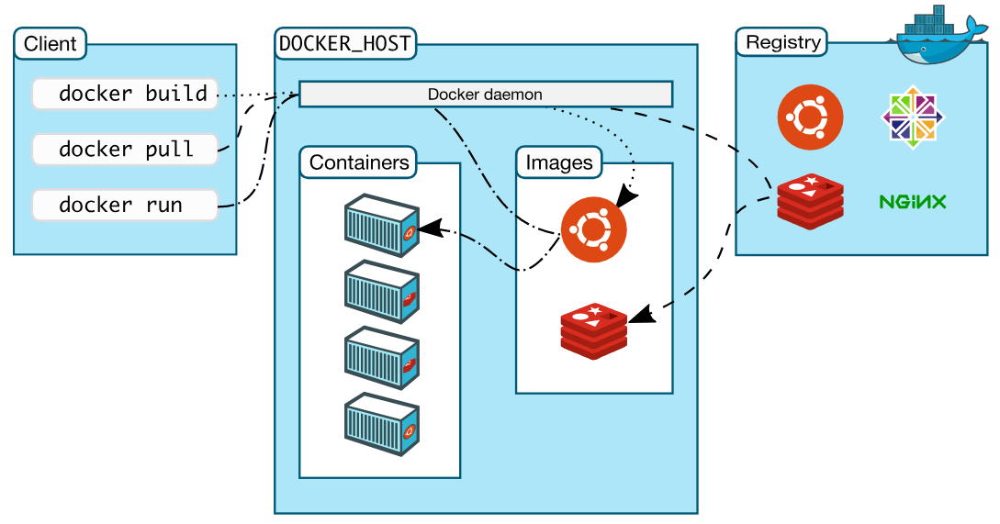

## Docker

### 1. 简介

Docker是一个开源的应用容器引擎，基于Go语言。

Docker可以让开发者打包应用以及依赖包到一个轻量级、可移植的容器中，然后发布到Linux机器上

Docker支持将软件编译成一个镜像(容器)，然后在镜像中各种软件做好配置，将镜像发布出去，其他使用者可以直接使用这个镜像，累死windows里的ghost操作系统

补充：

**Podman**是一个开源的容器管理工具，是一种无守护程序的容器引擎，它控制下的容器既**可以由root用户运行，也可以由非特权用户运行**，是Podman与Docker最大的差别之一。

### 2. Docker核心概念

`docker主机(Host)`：安装了Docker程序的机器（Docker直接安装在操作系统之上）；

`docker客户端(Client)`：连接docker主机进行操作；

`docker仓库(Registry)`：用来保存各种打包好的软件镜像；

`docker镜像(Images)`：软件打包好的镜像；放在docker仓库中；

`docker容器(Container)`：镜像启动后的实例称为一个容器；容器是独立运行的一个或一组应用



### 3. 基本命令

#### docker操作

1. 启动

    ```shell
    systemctl start docker
    ```

2. 重启

    ```shell
    systemctl restart  docker
    ```

3. 关闭

    ```shell
    systemctl stop docker
    ```


#### 镜像操作

| 操作 | 命令                                         | 说明                                                    |
| ---- | -------------------------------------------- | ------------------------------------------------------- |
| 检索 | docker search 关键字 eg：docker search redis | 我们经常去docker hub上检索镜像的详细信息，如镜像的TAG。 |
| 拉取 | docker pull 镜像名:tag                       | :tag是可选的，tag表示标签，多为软件的版本，默认是latest |
| 列表 | docker images                                | 查看所有本地镜像                                        |
| 删除 | docker rmi image-id                          | 删除指定的本地镜像                                      |

#### 容器操作

1. 下载相关镜像

2. 根据镜像启动容器，不加TAG默认latest，-d：后台启动

   ```shell
   docker run --name mytomcat -d tomcat:latest
   ```

3. 查看运行中的容器

   ```shell
   docker ps
   ```

4. 停止运行中的容器

   ```shell
   docker stop  容器的id或名称
   ```

5. 查看所有的容器

   ```shell
   docker ps -a
   ```

6. 启动容器

   ```shell
   docker start 容器id/名字
   ```

7. 删除一个容器

   ```shell
   docker rm 容器id/名字
   ```

8. 启动一个做了端口映射的tomcat

   ```shell
    docker run -d -p 8888:8080 tomcat
   ```

9. 关闭防火墙

   ```shell
   # 查看防火墙状态
   service firewalld status
   # 关闭防火墙
   service firewalld stop
   ```

10. 查看容器的日志

    ```shell
    docker logs 容器id/名字
    ```
    
11. 查看latest版本

    ```
    docker inspect elasticsearch:latest | grep -i version
    ```
    
12.  进入容器

    ```
    docker exec -it id /bin/bash
    ```

    

### 4. 参数

- --net=host （--network=host） 

  容器与主机享受相同的network namespace，访问主机端口就能访问容器


## 运行命令

### 运行nacos

先要执行建表语句：

https://github.com/alibaba/nacos/blob/master/config/src/main/resources/META-INF/nacos-db.sql

```shell
docker run -d --name nacos-mysql-standalone --net=host -v /home/nacos/logs:/home/nacos/logs -e MODE=standalone -e MYSQL_DATABASE_NUM=1 -e SPRING_DATASOURCE_PLATFORM=mysql -e MYSQL_MASTER_SERVICE_HOST=localhost -e MYSQL_MASTER_SERVICE_PORT=3306 -e MYSQL_MASTER_SERVICE_USER=root -e MYSQL_MASTER_SERVICE_PASSWORD=root -e MYSQL_MASTER_SERVICE_DB_NAME=nacos nacos/nacos-server:1.1.4
```

### 运行redis

先创建配置文件/home/docker/redis/config/redis.conf

```shell
docker run -p 6379:6379 --name redis5 -v /home/docker/redis/config/redis.conf:/etc/redis/redis.conf -v /home/docker/redis/data:/data -d redis:5.0.9 redis-server /etc/redis/redis.conf --appendonly yes
```


```shell
docker run --name redis01 -p 6379:6379 -d redis:5.0.9
```

